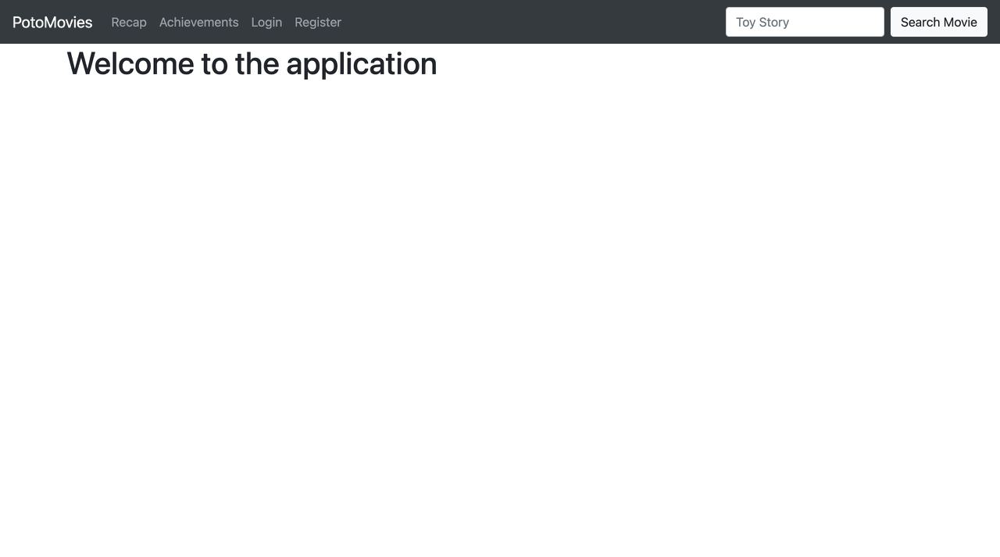
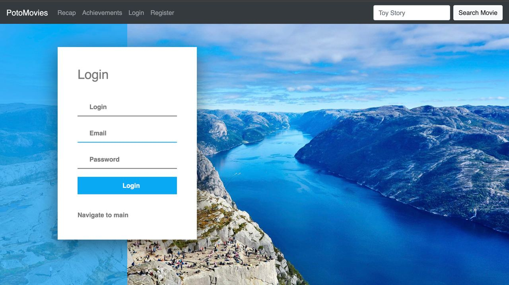
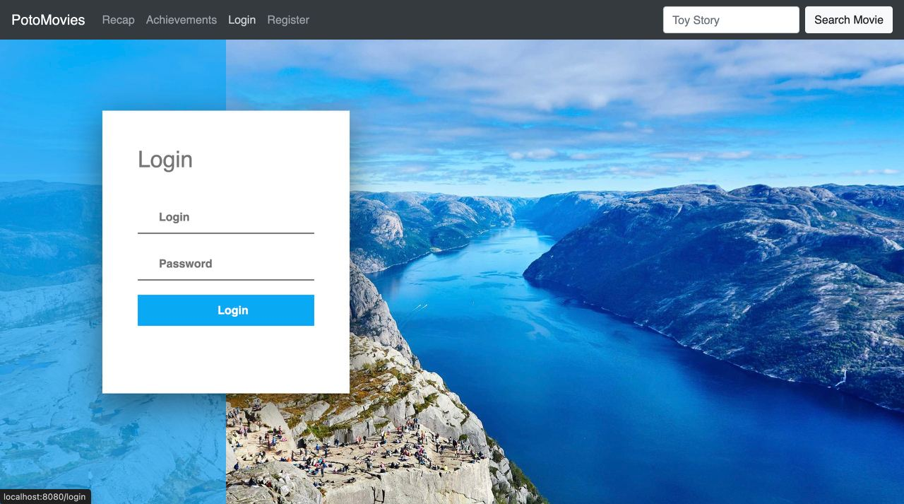
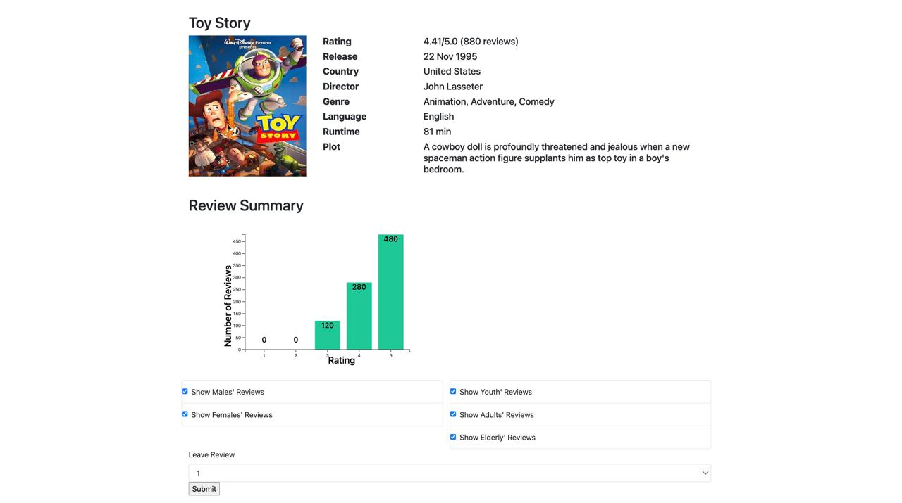

## CSE364 group4 -- User Documentation

This is the guidline for the users of our PotoMovies service.

### Last changes of the project before we start

* Registration and Login Features: We've implemented registration and login features to enhance the functionality of our application. Users can now register for accounts and log in to access personalized features.
* Search Bar: A search bar has been added to facilitate quick searching of movies by their names. Users can simply enter the name of a movie they're looking for and easily find it.
* Movie Preview Enhancements: We've included preview image covers for each movie, along with brief information such as rating, release date, country of origin, director, and more. This provides users with a better understanding of each movie before they view its details.

### What PotoMovies is about?
Our service aims to simplify the movie review process and provide an engaging way to interact with the system for users. Also, it reduces the time and effort sorting through extensive reviews. In addition, it presents quick insights from reviews with trend visualizations (bar chart). Application provides:

* Smart review summary using interactive plots (Summarizer) - Concise and informative summaries generated by NLP algorithms, providing key insights on movies, such as (rating, release, country, director, etc.).
* Recap Feature: This feature allows users to view their monthly or annual statistics. It presents this information in a simple and engaging way, with an option to share their data with friends.
* Achievement Feature: This feature introduces gamification, engagement, and goal setting, enhancing user interaction and making the experience more enjoyable.

## How It Works and How to Use Each Page

### 1) Main Page

This is the homepage of our application. It displays a menu bar featuring various places you can visit:

* Clicking on the [PotoMovies] button returns user to Main Page.
* Clicking on the [Register] button will redirect the user to the Register Page, where user can register to the service.
* Clicking on the [Login] button will redirect the user to the Login Page, where user can login to the service.
* Clicking on the [Recap] button will redirect the user to the Recap Page.
* Clicking on the [Achievements] button will redirect the user to the Achievements Page.
* The Search Bar allows users to search for movies by their names (for example: "Toy Story"). When a user enters a movie name and clicks search, the system presents the matching movie options. By clicking on a movie title from the search results, users can view the Movie Page, where we've implemented our Summary feature.

### 2) Registration Page

Here, users can register for the service by providing their "login," "email," and "password." The password must meet certain criteria: it should contain at least one number, one uppercase letter, one lowercase letter, and be at least 8 characters long. After successful registration, the user is redirected back to the Login Page.

### 3) Login Page

Here, users can access their Personal Page by entering the data they used during registration. If the user enters incorrect information, they will be redirected to the Error Page.

### 4) Recap Page

[PHOTO OF RECAP PAGE]

* Clicking on the [] button does 
* Clicking on the [] button does 
* Clicking on the [] button does 
* Clicking on the [] button does 

### 5) Achievements Page

[PHOTO OF ACHIEVEMENTS PAGE]

* Clicking on the [] button does 
* Clicking on the [] button does 
* Clicking on the [] button does 
* Clicking on the [] button does 

### 6) Movie Page

On this page, users can view the preview image cover of the movie along with detailed information including its rating, release date, country of origin, director, genre, language, runtime, and plot synopsis. 

Additionally, we've included an interactive bar chart below this data. This bar chart allows users to explore differences in ratings by navigating through various criteria.Users can customize the bar chart by including or excluding certain criteria, such as considering ratings from males only, or considering ratings from different age categories (youth 1-24, adults 25-55, and elderly 56+).

Below the bar chart, users have the option to submit their own rating for the movie on a scale of 1 to 5. This interactive feature enhances user engagement and allows them to contribute to the community's ratings of the movie.

